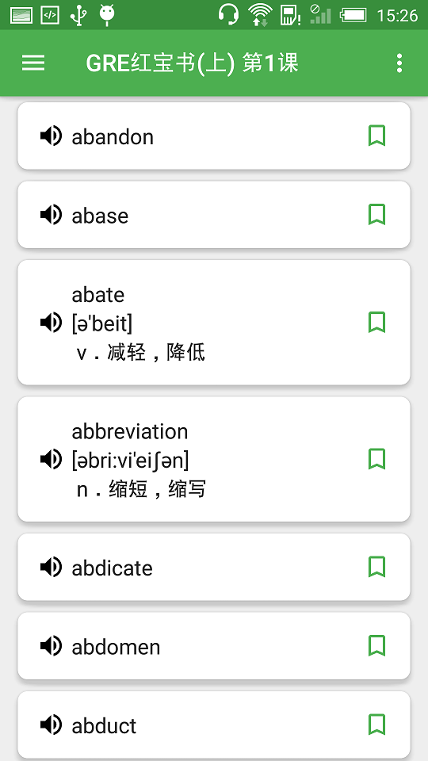
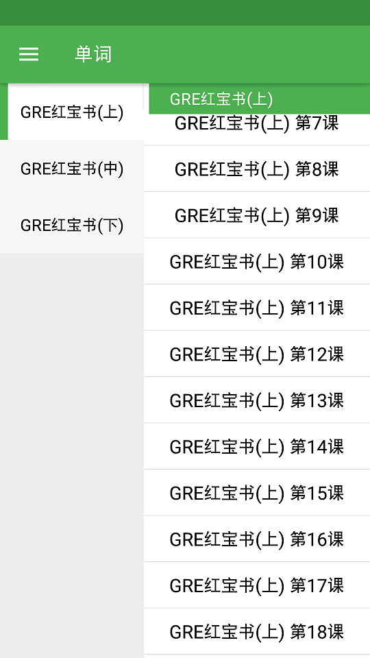

# 鲤鱼英语

鲤鱼英语基于MVP+RxJava2+Retrofit2,一个简单的英语单词记忆App，它包含了常见的英语词库GRE红宝书，支持乱序记忆及生词收藏，在[News API](https://newsapi.org/)的帮助下，可浏览英文新闻

- Material Design
- RxJava2(Not RxJava1.x)
- Retrofit2
- 支持TTS语音（来自有道语音）
- 下拉开启乱序记忆
- 生词收藏分类到每课
- 英文新闻

## 效果图

   

 

## Forked & Thanks

- [JPStart](https://github.com/pwcong/JPStart)
- [MyTimes](https://github.com/debajyotibasak/MyTimes)
- [Zhihu](https://github.com/yiyibb/Zhihu)

## 第三方库
- [RxJava](https://github.com/ReactiveX/RxJava)
- [Glide](https://github.com/bumptech/glide)
- [ButterKnife](https://github.com/JakeWharton/butterknife)
- [Retrofit](https://github.com/square/retrofit)
- [leakcanary](https://github.com/square/leakcanary)
- [News API](https://newsapi.org/)
- [PhotoView](https://github.com/chrisbanes/PhotoView)
- [baseAdapter](https://github.com/hongyangAndroid/baseAdapter)
- [material-design-icons](https://github.com/google/material-design-icons)
- [multiline-collapsingtoolbar](https://github.com/opacapp/multiline-collapsingtoolbar)
- [RecyclerViewAnimation](https://github.com/nuptboyzhb/RecyclerViewAnimation)
- [RecyclerView](https://github.com/zhanglongt/RecyclerView)

### 感谢浏览，喜欢请赏star。